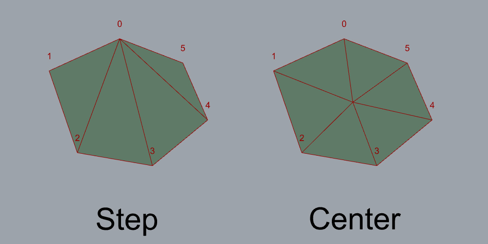
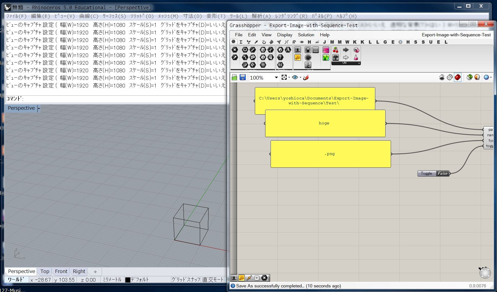
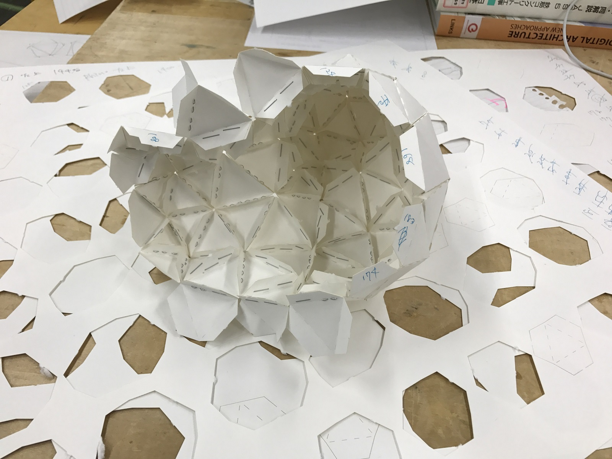
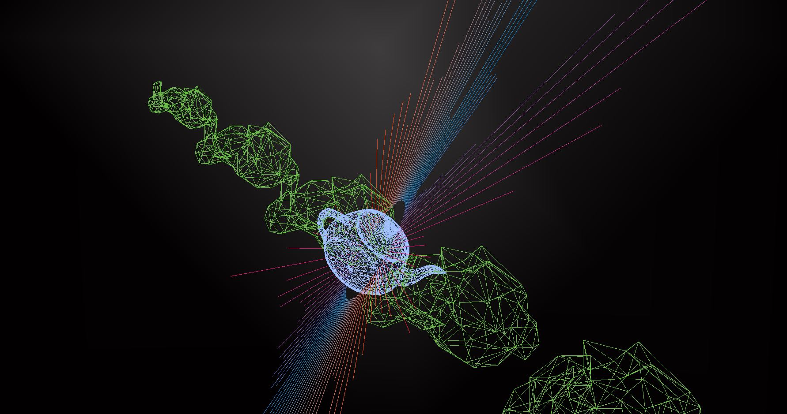
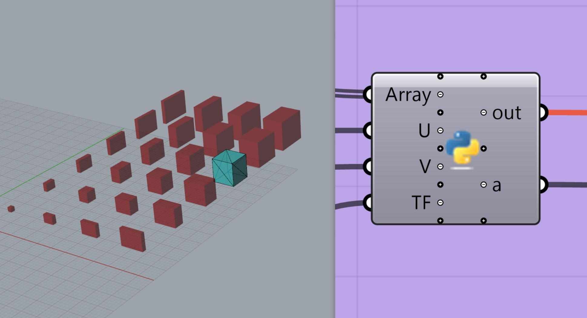
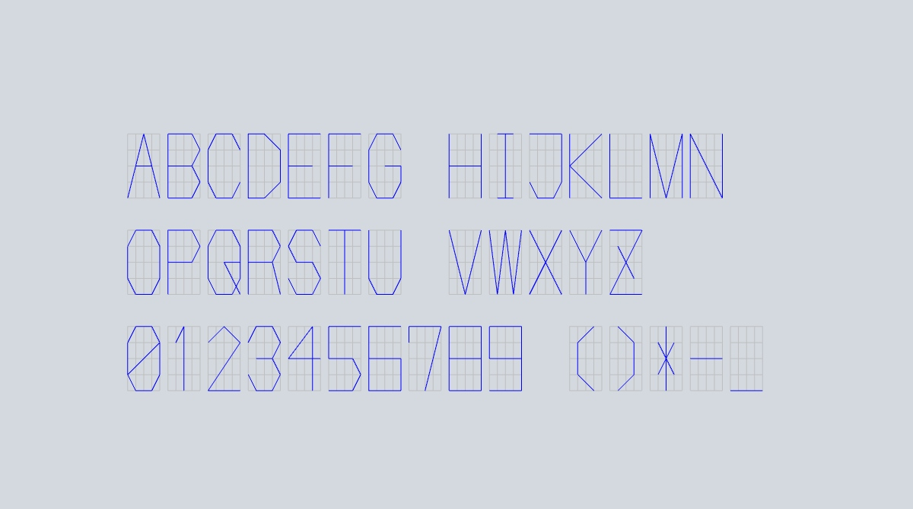
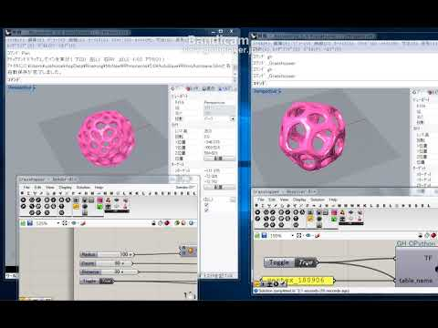
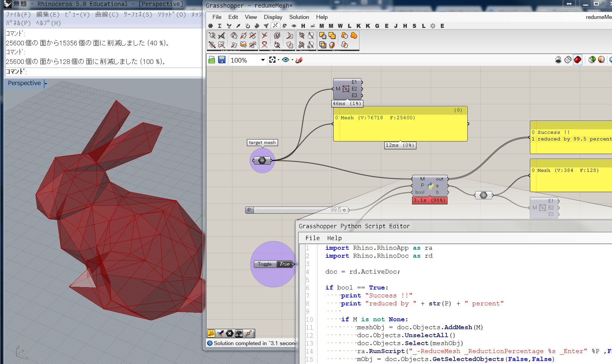
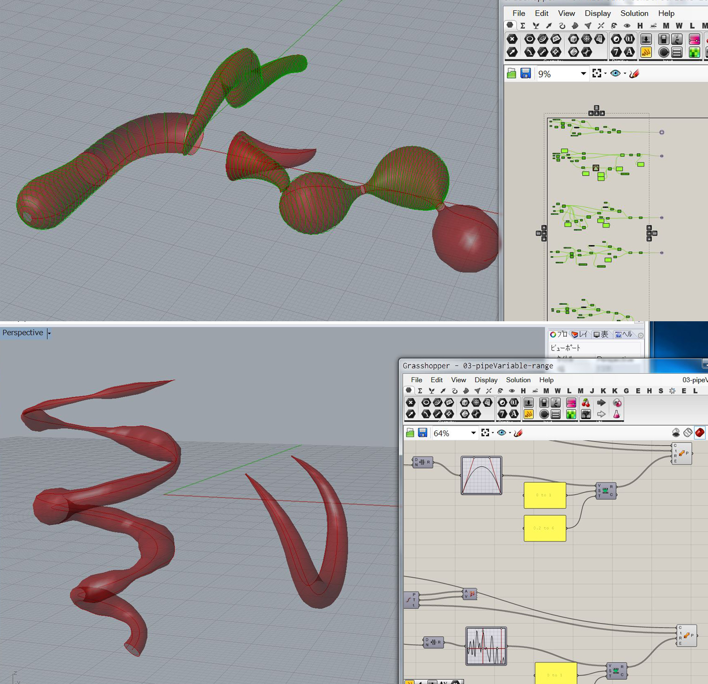

# gh_ny // ちょっと便利っぽい Grasshopper のスクリプト  

毎日毎日、いつかのどこかの誰かがインターネットに残してくれた情報によって、多大な恩恵を受けていて、そういうものにいつもいつも助けられている。  

最近は、その恩を少しずつでも返していけたらと思っているので、制作の過程で作ったちょっと便利っぽいスクリプトを公開していきたいと思っています。  

それぞれ GitHub の各リポジトリに飛びます。  

ライセンスとか書いてませんがどうぞご自由に。  

### index  

- Construct_Mesh_from_CLosed_Curve  
- Export-Image-with-Sequence  
- GenerateCuttingLine-from-UnrolledSurface   
- ghx3DVJ  
- GrasshopperBake-with-SerialNumber  
- Matrix_Font  
- MeshStreaming_via_DB  
- ReduceMesh-via-ghPython  
- Study-makeSurface-gh  

---  

---  

# Construct_Mesh_from_CLosed_Curve  

メッシュの穴埋めアルゴリズム。  
凹型（Concave）、凸型（Convex）に分類し、凸型は簡単に埋められるとわかった。  
今後、凹型凸型の判別と、凹型を凸型に分割を考えたい。  

ソースコードはこちら([GitHub](https://github.com/naysok/Construct_Mesh_from_CLosed_Curve))  

  

---  

# Export-Image-with-Sequence  

rs.Command("-ViewportCaputureToFile") で連番で画像を書き出す。  
Rhino5 では動作確認しています。  

ソースコードはこちら([GitHub](https://github.com/naysok/Export-Image-with-Sequence))  

  

---  

# GenerateCuttingLine-from-UnrolledSurface  

UnrollSurface に自動でのりしろを生成して、レーザー加工用の線データを作成するスクリプト。  
卒制の時に作ったものを多少綺麗に整理しました。  
レーザーの強さを調整してケガいてで折り線を作るのは調整がシビア過ぎるので、折り線の部分は点線です。  

ソースコードと使い方はこちら ([GitHub](https://github.com/naysok/GenerateCuttingLine-from-UnrolledSurface))　　

  

---  

# ghx3DVJ  

僕が好んで使っている Grasshopper で VJ ツールを作った。  
Rhino を使っているので、3D オブジェクトを弄りやすい。ちょっと便利だと思います。  
速度とか、不安定な FPS とかその辺がネックになるカモ...  
色々美しくないので、手を入れてちゃんと直したい。  

ソースコードはこちら([GitHub](https://github.com/naysok/ghx3DVJ))  

  

---  

# GrasshopperBake-with-SerialNumber  

K個の数列、UxV個の行列を、連番の名前をつけて、自動で STL に書き出すスクリプト。  
id を振っておかないといけない時に、手でちまちまやりたくないので。  

ソースコードはこちら ([GitHub](https://github.com/naysok/GrasshopperBake-with-SerialNumber))  

  

---  

# Matrix_Font  

けがき用のミニマムなフォント。  
ごく一部だけ2重になりますが、基本的にワンストロークで、加工時の短縮に効くと思う。  

ソースコードはこちら([GitHub](https://github.com/naysok/Matrix_Font))  

  

---  

# MeshStreaming_via_DB  

メッシュを座標に分解して、PostgreSQL に投げる。  
PostgreSQL から、座標データを取り出してメッシュを構築する。  
Unity とか、その辺整えたい。  
重いので、送り方を考えたい。Python がネックになってそう。  

ソースコードはこちら([GitHub](https://github.com/naysok/MeshStreaming_via_DB))  

  

---  

# ReduceMesh-via-ghPython  

ReduceMesh を、ghPython の中で呼び出すスクリプト。  
gh のフローの中で、メッシュの削減ができる。  

ソースコードはこちら ([GitHub](https://github.com/naysok/ReduceMesh-via-ghPython))  

  

---  

# Study-makeSurface-gh  

フィギュアのような曲面をいくつか作った時に色々試したもので、今後も使えそうなスクリプト。  

2本のアウトラインのパス間でうまく断面パスを作って Loft して良さげな曲面を作るものと、  
可変半径の Pipe だけで済ましてるものと、あとは、 BoxMorph 的なもの、とりあえず3種類。  

ソースコードはこちら ([GitHub](https://github.com/naysok/Study-makeSurface-gh))  

  

---  

---  